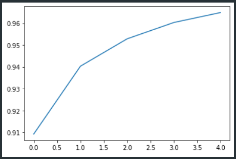
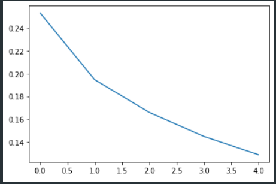
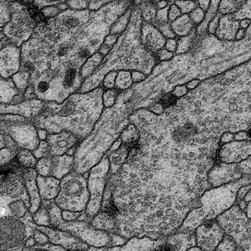
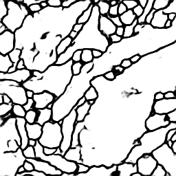

# Segmentation des Images de la Microscopie Électronique

## Architecture du modèle

Notre modèle est basé sur l'architecture `UNET` et se structure de la façon suivante:

Ce qui nous donne l'architecture suivante avec `Tensorflow` et python.

---

## Courbes de performances

Nous avons représenté deux métriques pour notre modèle, `accuracy` et `loss`.

- Courbe pour l'accuracy:

- Courbe pour le loss:

---

## Résultats

Le modèle est plutôt précis, voici quelques exemples sur des images de test:

- Image initiale

- Prédiction du modèle

Autre exemple avec une autre image.

- Image initiale

- Prédiction du modèle

