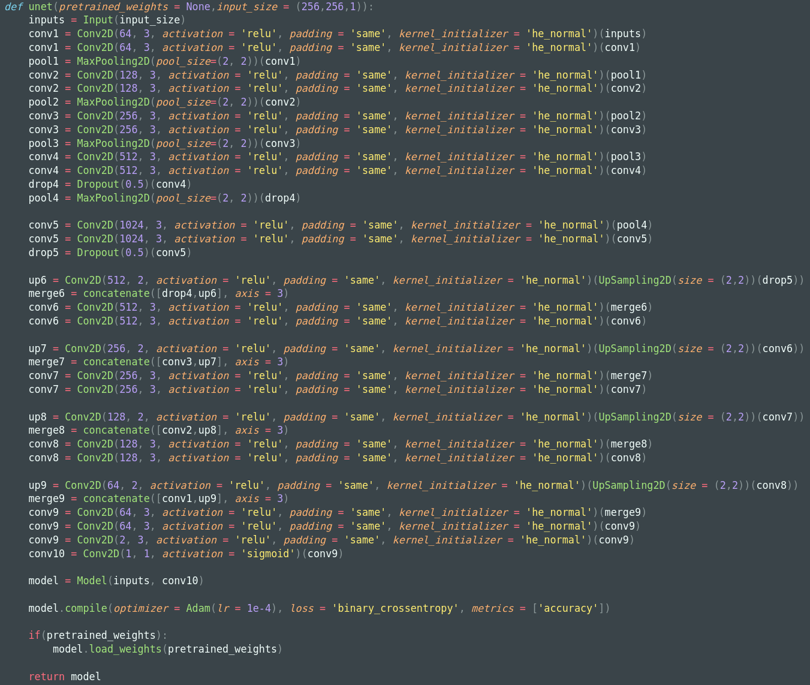

# Segmentation des Images de la Microscopie Électronique

## Architecture du modèle

Notre modèle est basé sur l'architecture `UNET` et se structure de la façon suivante:

---

## Courbes de performances

---

## Résultats